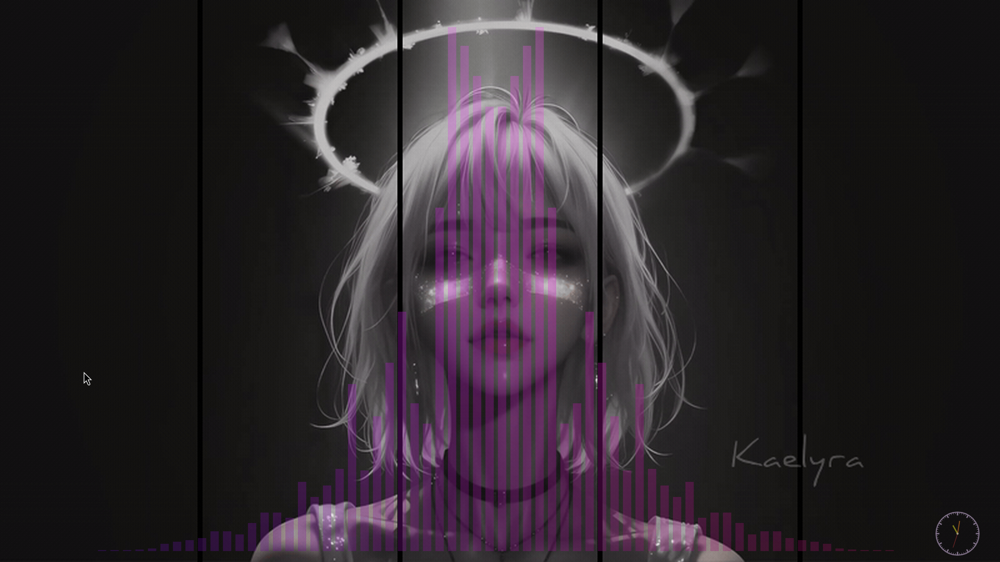
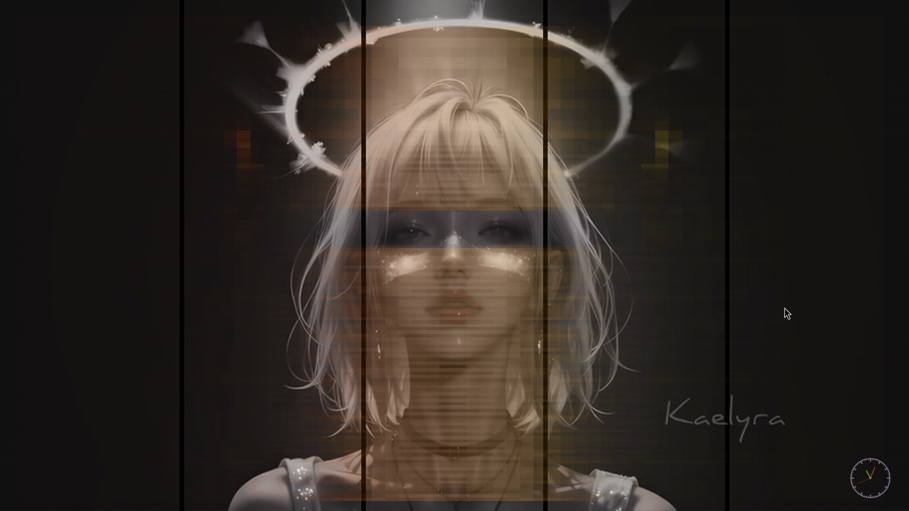

# Cavibe

Audio visualizer with animated song display - terminal and wallpaper modes.

Cavibe captures system audio, performs frequency analysis, and displays colorful visualizations alongside animated track information from MPRIS-compatible music players.


*Radial style with spectrum color scheme as a Wayland wallpaper*

## Features

- **8 visualizer styles**: Classic bars, mirrored, wave, dots, blocks, oscilloscope, spectrogram, radial
- **7 color schemes**: Spectrum, rainbow, fire, ocean, forest, purple, monochrome
- **Animated song text**: Pulsing colors synced to audio intensity with multiple font styles and animations
- **MPRIS integration**: Displays current track from Spotify, MPD, VLC, etc.
- **Terminal mode**: Full TUI experience with keyboard controls
- **Wallpaper mode**: Native Wayland layer-shell support (Niri, Sway, Hyprland)
- **Drag-to-move**: Reposition the wallpaper interactively with click and drag
- **Runtime control**: `cavibe ctl` commands for compositor keybind integration
- **State persistence**: All changes auto-save to config and persist across restarts

## Screenshots

### Wallpaper Mode

All screenshots show cavibe running as a Wayland wallpaper overlay on a desktop background.

| Radial + Spectrum | Radial + Purple |
|-------------------|-----------------|
|  |  |

| Classic Bars + Purple | Classic Bars + Monochrome |
|-----------------------|--------------------------|
|  |  |

| Oscilloscope + Spectrum | Spectrogram + Fire |
|-------------------------|--------------------|
|  |  |

| Dots + Fire |
|-------------|
|  |

## Installation

### Using Nix

```bash
nix develop  # Enter development shell
cargo build --release
```

### Manual

Requires Rust 1.70+ and the following system dependencies:

- ALSA or PulseAudio/PipeWire for audio capture
- D-Bus for MPRIS metadata

```bash
cargo build --release
./target/release/cavibe
```

## Usage

```bash
# Basic usage (terminal mode)
cavibe

# With options
cavibe --bars 128 --colors fire

# Wallpaper mode (Wayland)
cavibe --mode wallpaper

# Control a running wallpaper instance
cavibe ctl style next
cavibe ctl color next
cavibe ctl resize +50
cavibe ctl drag on
cavibe ctl text toggle
```

### Keyboard Controls (Terminal Mode)

| Key | Action |
|-----|--------|
| `s` | Cycle visualizer style |
| `c` | Cycle color scheme |
| `q` / `Ctrl+C` | Quit |

### IPC Control (Wallpaper Mode)

Control a running wallpaper instance with `cavibe ctl`. All changes persist across restarts.

```bash
# Visualizer
cavibe ctl style next          # Cycle styles
cavibe ctl color next          # Cycle color schemes
cavibe ctl opacity 0.5         # Set opacity

# Layout
cavibe ctl resize +50          # Grow from center by 50px
cavibe ctl resize -10%         # Shrink from center by 10%
cavibe ctl drag on             # Enable drag-to-move
cavibe ctl anchor center       # Set anchor position
cavibe ctl layer bottom        # Change layer-shell layer

# Text
cavibe ctl text toggle         # Toggle track info
cavibe ctl text font figlet    # Change font style

# Info
cavibe ctl status              # Show current state
cavibe ctl list styles         # List available styles
```

See [full IPC reference](docs/configuration.md#ipc-control-wallpaper-mode) for all commands.

## Documentation

- [Configuration](docs/configuration.md) - Config file reference, CLI arguments, and IPC commands
- [Wallpaper Mode](docs/wallpaper.md) - Setup for Niri, Sway, Hyprland
- [Runtime Control](docs/runtime-control.md) - `cavibe ctl` commands and keybind integration
- [Styles & Themes](docs/styles.md) - Visualizer styles, color schemes, fonts, and animations

## Requirements

- Linux (uses ALSA/PulseAudio and MPRIS)
- A terminal with true color support (kitty, alacritty, wezterm, etc.)
- Music player with MPRIS support for track info

## License

MIT
