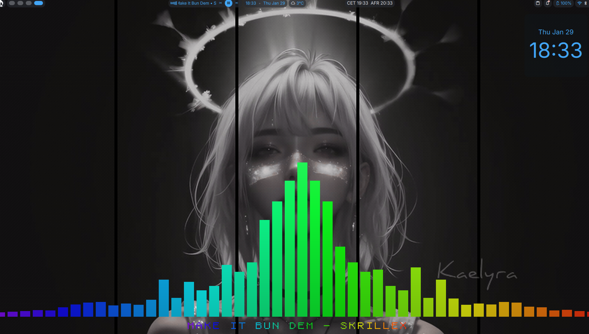
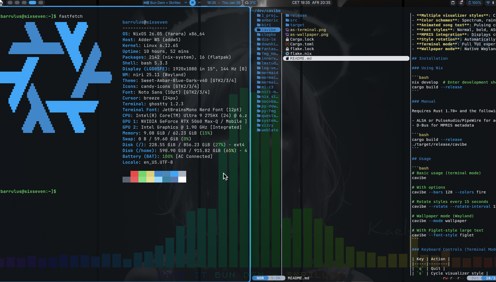
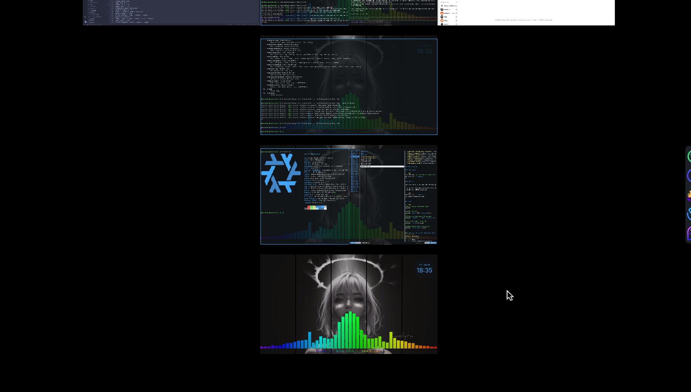
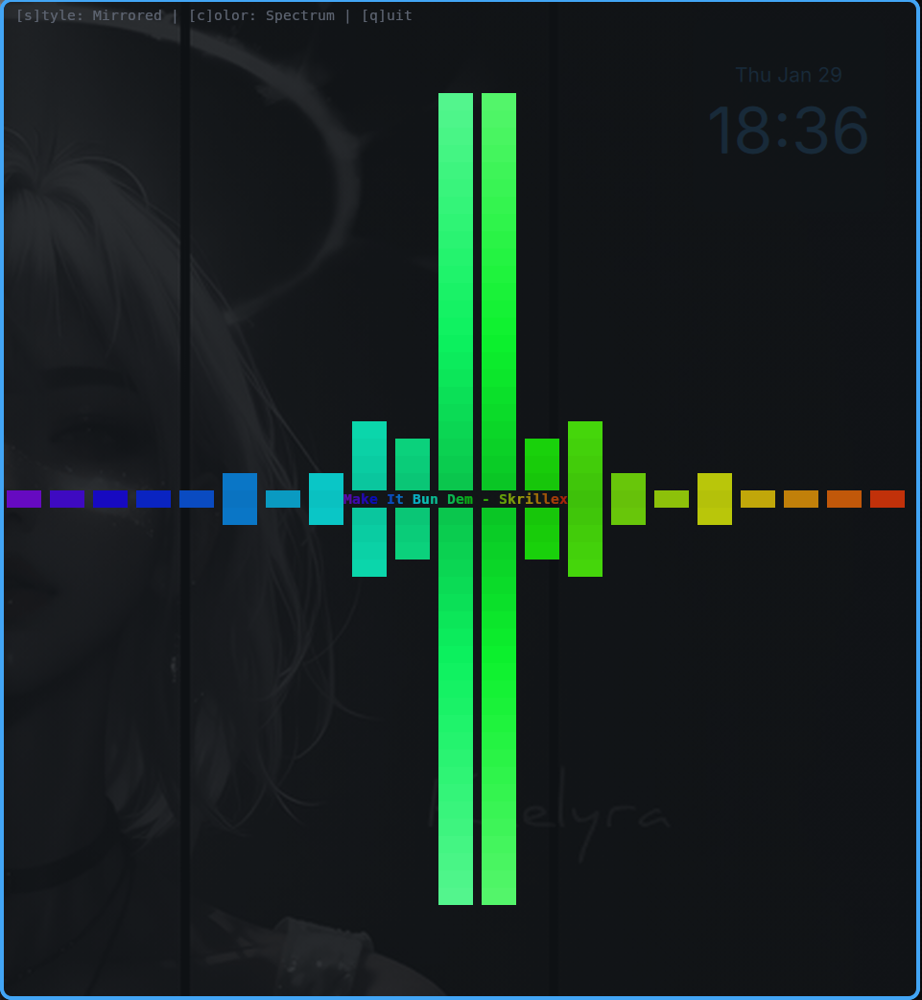
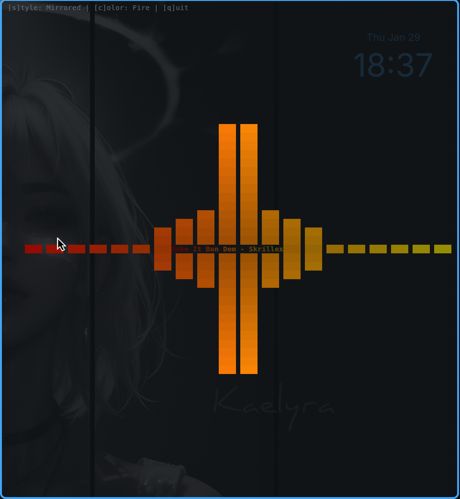
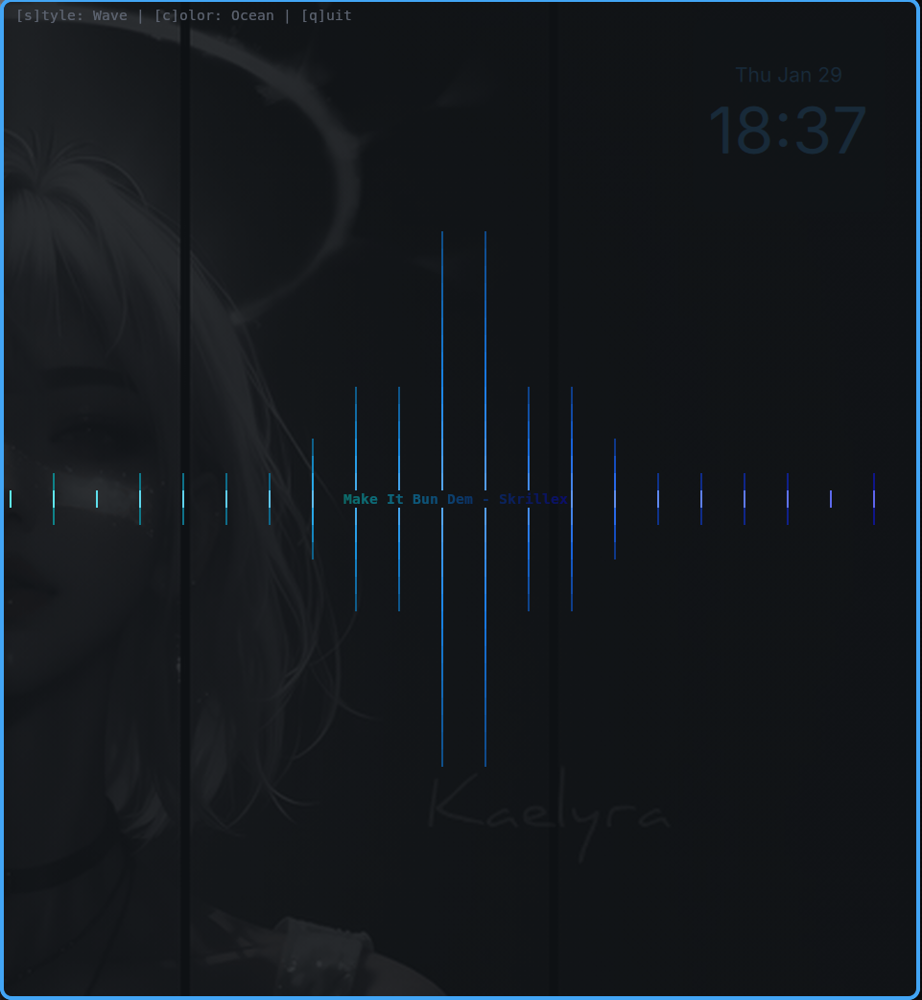
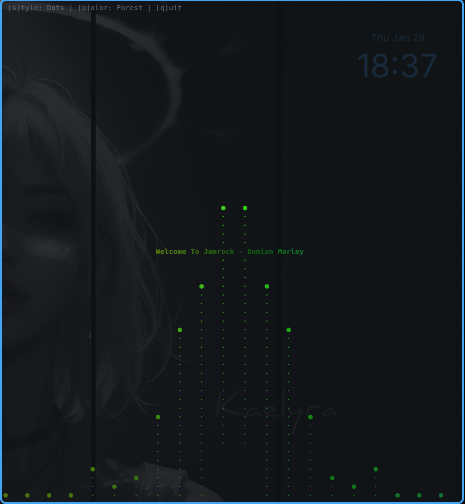

# Cavibe

Audio visualizer with animated song display - terminal and wallpaper modes.

Cavibe captures system audio, performs frequency analysis, and displays colorful visualizations alongside animated track information from MPRIS-compatible music players.

## Features

- **Multiple visualizer styles**: Classic bars, mirrored, wave, dots, blocks
- **Color schemes**: Spectrum, rainbow, fire, ocean, forest, purple, monochrome
- **Animated song text**: Pulsing colors synced to audio intensity with multiple font styles and animations
- **MPRIS integration**: Displays current track from Spotify, MPD, VLC, etc.
- **Terminal mode**: Full TUI experience with keyboard controls
- **Wallpaper mode**: Native Wayland layer-shell support (Niri, Sway, Hyprland)
- **Runtime control**: `cavibe ctl` commands for compositor keybind integration

## Screenshots

### Wallpaper Mode


*Cavibe running as a desktop wallpaper with spectrum color scheme*


*Wallpaper mode visible behind terminal windows*


*Niri workspace overview showing cavibe wallpaper*

### Terminal Mode

| Mirrored + Spectrum | Mirrored + Fire |
|---------------------|-----------------|
|  |  |

| Wave + Ocean | Dots + Forest |
|--------------|---------------|
|  |  |

## Installation

### Using Nix

```bash
nix develop  # Enter development shell
cargo build --release
```

### Manual

Requires Rust 1.70+ and the following system dependencies:

- ALSA or PulseAudio/PipeWire for audio capture
- D-Bus for MPRIS metadata

```bash
cargo build --release
./target/release/cavibe
```

## Usage

```bash
# Basic usage (terminal mode)
cavibe

# With options
cavibe --bars 128 --colors fire

# Wallpaper mode (Wayland)
cavibe --mode wallpaper

# Control a running wallpaper instance
cavibe ctl style next
cavibe ctl toggle
```

### Keyboard Controls (Terminal Mode)

| Key | Action |
|-----|--------|
| `s` | Cycle visualizer style |
| `c` | Cycle color scheme |
| `q` / `Ctrl+C` | Quit |

## Documentation

- [Wallpaper Mode](docs/wallpaper.md) - Setup for Niri, Sway, Hyprland, X11
- [Runtime Control](docs/runtime-control.md) - `cavibe ctl` commands and keybind integration
- [Configuration](docs/configuration.md) - Config file reference
- [Styles & Themes](docs/styles.md) - Visualizer styles, color schemes, fonts, and animations

## Requirements

- Linux (uses ALSA/PulseAudio and MPRIS)
- A terminal with true color support (kitty, alacritty, wezterm, etc.)
- Music player with MPRIS support for track info

## Roadmap

- [x] Wallpaper mode (Wayland layer-shell)
- [x] Figlet/ASCII art text styles
- [x] Proportional bar width/spacing
- [x] Text animations in wallpaper mode (scroll, pulse, fade, wave)
- [x] Custom title/artist colors with background
- [x] Runtime control via CLI (`cavibe ctl`) for keybind integration
- [ ] X11 native wallpaper mode (without xwinwrap)
- [ ] Album art display
- [ ] Custom color schemes from config
- [ ] More visualizer styles
- [ ] Audio device selection menu
- [ ] Multi-monitor support for wallpaper mode

## Troubleshooting

### Wallpaper mode shows error about layer-shell

Your compositor doesn't support the `wlr-layer-shell` protocol. This is required for native wallpaper mode. Use the transparent terminal alternative described in [wallpaper docs](docs/wallpaper.md#transparent-terminal-alternative).

### No audio visualization

1. Ensure PipeWire or PulseAudio is running
2. Check that audio is playing through your default sink
3. Try increasing sensitivity: `cavibe --sensitivity 2.0`

### No track info displayed

Cavibe uses MPRIS to get track metadata. Ensure your music player supports MPRIS (most do: Spotify, Firefox, VLC, MPD with mpDris2, etc.).

## License

MIT
