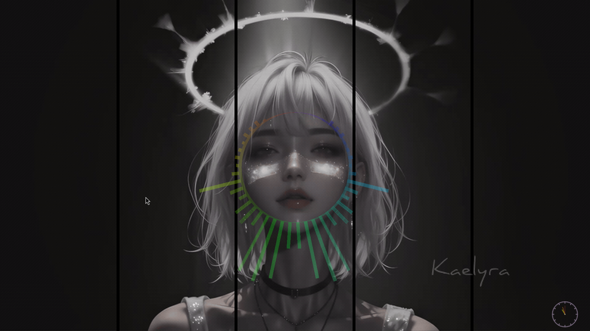

# Configuration

Cavibe looks for a config file at `~/.config/cavibe/config.toml`. Generate a default config with:

```bash
cavibe --init-config
```

The config file is also auto-created when state changes are made via IPC (e.g. changing style, dragging the wallpaper). All IPC state changes are automatically persisted to the config file, preserving comments.

CLI arguments take priority over config file values.

## Full Reference

```toml
[display]
mode = "terminal"           # "terminal" or "wallpaper"
rotate_styles = false       # auto-cycle visualizer styles
rotation_interval_secs = 30 # seconds between style changes

[audio]
# device = "pulse"          # audio device name (null = default)
sample_rate = 44100
buffer_size = 1024
smoothing = 0.7
sensitivity = 1.0           # 0.1-10.0, higher = more reactive

[visualizer]
bars = 64
color_scheme = "spectrum"   # spectrum, rainbow, fire, ocean, forest, purple, monochrome
# style = "classic bars"    # classic bars, mirrored, wave, dots, blocks, oscilloscope, spectrogram, radial
bar_width = 2               # proportional width of bars
bar_spacing = 1             # proportional spacing between bars
mirror = false              # mirror visualization from center
reverse_mirror = false      # with mirror: lows meet in middle, highs on outside
opacity = 1.0               # 0.0-1.0, bar transparency (wallpaper mode only)

[text]
show_title = true
show_artist = true
animation_speed = 1.0
pulse_intensity = 0.8
position = "bottom"         # top, bottom, center, or "X,Y" (e.g. "50%,90%")
font_style = "normal"       # normal, bold, ascii, figlet
alignment = "center"        # left, center, right
animation_style = "scroll"  # none, scroll, pulse, fade, wave
margin_top = 0              # pixels in wallpaper mode, characters in terminal
margin_bottom = 0
margin_horizontal = 2
use_color_scheme = true     # false to use custom colors below
# title_color = { r = 255, g = 255, b = 255 }
# artist_color = { r = 200, g = 200, b = 200 }
# background_color = { r = 0, g = 0, b = 0 }  # text background (wallpaper only)

[wallpaper]
layer = "background"        # background, bottom, top, overlay
anchor = "fullscreen"       # fullscreen, center, top, bottom, left, right,
                            # top-left, top-right, bottom-left, bottom-right
# width = "50%"             # pixels (e.g. "800") or percentage (e.g. "50%")
# height = "200"
# margin = 10               # uniform margin from all edges (pixels)
# margin_top = 0
# margin_right = 0
# margin_bottom = 0
# margin_left = 0
draggable = false           # enable drag-to-move (saves position to config)
multi_monitor = "clone"     # "clone" (same on all) or "independent" (per-monitor)
# outputs = ["DP-1"]        # only show on these outputs (omit for all)

# Per-monitor overrides (independent mode only):
# [[wallpaper.monitors]]
# output = "DP-1"
# enabled = true
# color_scheme = "rainbow"
# style = "wave"
# opacity = 0.8
# audio_source = "alsa_output.pci-0000_01_00.1.hdmi-stereo"
```

## CLI Arguments

All config values can be overridden from the command line. CLI takes priority over config file.

### General

| Flag | Description |
|------|-------------|
| `-m, --mode <MODE>` | Display mode: `terminal` or `wallpaper` |
| `-c, --config <PATH>` | Config file path |
| `--init-config` | Generate default config at `~/.config/cavibe/config.toml` |
| `--no-config` | Skip loading config file |

### Visualizer

| Flag | Description |
|------|-------------|
| `-b, --bars <N>` | Number of frequency bars (default: 64) |
| `--colors <SCHEME>` | Color scheme name |
| `--style <NAME>` | Visualizer style (e.g. `"wave"`, `"dots"`) |
| `--bar-width <N>` | Proportional bar width |
| `--bar-spacing <N>` | Proportional bar spacing |
| `--mirror` | Mirror visualization horizontally |
| `--reverse-mirror` | Reverse mirror pattern (requires `--mirror`) |
| `--opacity <F>` | Opacity 0.0-1.0 (wallpaper mode only) |
| `--rotate` | Auto-rotate visualizer styles |
| `--rotate-interval <SECS>` | Rotation interval in seconds (default: 30) |

### Audio

| Flag | Description |
|------|-------------|
| `--audio-device <NAME>` | Audio device name (e.g. `"pulse"`) |
| `--sample-rate <HZ>` | Sample rate (default: 44100) |
| `--buffer-size <N>` | Audio buffer size (default: 1024) |
| `--smoothing <F>` | Smoothing factor 0.0-1.0 (default: 0.7) |
| `-s, --sensitivity <F>` | Audio sensitivity 0.1-10.0 (default: 1.0) |

### Text

| Flag | Description |
|------|-------------|
| `--show-title <BOOL>` | Show track title |
| `--show-artist <BOOL>` | Show artist name |
| `--text-position <POS>` | Position: `top`, `bottom`, `center`, or `X,Y` coordinates |
| `--font-style <STYLE>` | Font: `normal`, `bold`, `ascii`, `figlet` |
| `--text-alignment <ALIGN>` | Alignment: `left`, `center`, `right` |
| `--text-animation <ANIM>` | Animation: `scroll`, `pulse`, `fade`, `wave`, `none` |
| `--animation-speed <F>` | Animation speed multiplier |
| `--pulse-intensity <F>` | Pulse intensity 0.0-1.0 |
| `--margin-top <N>` | Top margin for text area |
| `--margin-bottom <N>` | Bottom margin for text area |
| `--margin-horizontal <N>` | Horizontal margin for text area |
| `--title-color <HEX>` | Title color (e.g. `"#FF0000"`) |
| `--artist-color <HEX>` | Artist color (e.g. `"#00FF00"`) |

### Wallpaper

| Flag | Description |
|------|-------------|
| `--wallpaper-size <WxH>` | Size: pixels or % (e.g. `"400x300"`, `"50%x50%"`) |
| `--wallpaper-anchor <POS>` | Anchor position (e.g. `fullscreen`, `center`, `bottom`) |
| `--wallpaper-margin <PX>` | Uniform margin from all edges |
| `--wallpaper-layer <LAYER>` | Layer-shell layer: `background`, `bottom`, `top`, `overlay` |
| `--output <NAMES>` | Only show on specific outputs (comma-separated, e.g. `"DP-1,HDMI-A-1"`) |
| `--multi-monitor <MODE>` | Multi-monitor mode: `clone` or `independent` |

## IPC Control (Wallpaper Mode)

A running wallpaper instance can be controlled via `cavibe ctl` commands. All changes are automatically saved to the config file and persist across restarts.

| Radial + Spectrum | Classic Bars + Purple | Spectrogram + Fire |
|-------------------|-----------------------|--------------------|
|  |  |  |

### Visualizer

| Command | Description |
|---------|-------------|
| `cavibe ctl style next` | Cycle to next visualizer style |
| `cavibe ctl style prev` | Cycle to previous style |
| `cavibe ctl color next` | Cycle to next color scheme |
| `cavibe ctl color prev` | Cycle to previous color scheme |
| `cavibe ctl opacity <F>` | Set opacity 0.0-1.0 |
| `cavibe ctl toggle` | Toggle visualizer visibility |

### Text

| Command | Description |
|---------|-------------|
| `cavibe ctl text toggle` | Toggle text (title/artist) visibility |
| `cavibe ctl text position <POS>` | Set text position: `top`, `bottom`, `center` |
| `cavibe ctl text font <STYLE>` | Set font style: `normal`, `bold`, `ascii`, `figlet` |
| `cavibe ctl text animation <ANIM>` | Set animation: `scroll`, `pulse`, `fade`, `wave`, `none` |

### Wallpaper Layout

| Command | Description |
|---------|-------------|
| `cavibe ctl layer next` | Cycle to next layer-shell layer |
| `cavibe ctl layer prev` | Cycle to previous layer |
| `cavibe ctl layer <NAME>` | Set specific layer (`background`, `bottom`, `top`, `overlay`) |
| `cavibe ctl anchor <POS>` | Set anchor position (e.g. `center`, `top-left`, `fullscreen`) |
| `cavibe ctl margin <T> <R> <B> <L>` | Set margins (top right bottom left) |
| `cavibe ctl resize <WxH>` | Resize wallpaper (e.g. `800x600`, `50%x50%`) |
| `cavibe ctl resize +50` | Grow both dimensions by 50px (resizes from center) |
| `cavibe ctl resize -10%` | Shrink both dimensions by 10% (resizes from center) |

### Drag-to-Move

| Command | Description |
|---------|-------------|
| `cavibe ctl drag toggle` | Toggle drag-to-move mode |
| `cavibe ctl drag on` | Enable drag-to-move |
| `cavibe ctl drag off` | Disable drag-to-move |

When drag is enabled, left-click and drag the wallpaper surface to reposition it. The position is automatically saved to the config file on mouse release.

**Note:** Drag-to-move requires a non-background layer (e.g. `bottom`, `top`, `overlay`) to receive pointer events. When drag is enabled, the anchor is automatically converted to `top-left` for reliable margin-based positioning.

### Audio

| Command | Description |
|---------|-------------|
| `cavibe ctl set-source <NAME>` | Switch audio source (use `"default"` to revert) |
| `cavibe ctl list sources` | List available audio sources |

### Info

| Command | Description |
|---------|-------------|
| `cavibe ctl status` | Show current status (style, color, layer, anchor, size, margins, draggable) |
| `cavibe ctl list styles` | List available visualizer styles |
| `cavibe ctl list colors` | List available color schemes |
| `cavibe ctl list monitors` | List connected monitors |
| `cavibe ctl list layers` | List available layers (current marked with `*`) |
| `cavibe ctl ping` | Check if daemon is running |
| `cavibe ctl reload` | Reload config file |

### Notes

- **Layer changes** require destroying and recreating the Wayland surface. Anchor, margin, and size changes are applied dynamically.
- **Resize** grows/shrinks from the visual center — the surface stays in place rather than expanding from a corner.
- **Text scales** proportionally with the surface size. Smaller surfaces get smaller text, larger surfaces get larger text.
- **State persistence**: All IPC changes (style, color, opacity, text settings, layer, anchor, margins, size, drag state) are automatically saved to `~/.config/cavibe/config.toml`. If the config file doesn't exist, it is created from the default template with full comments.
